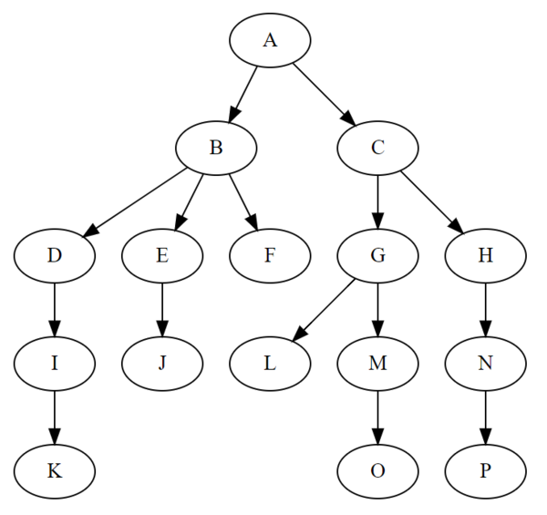

[tree]
== 树
树是一种抽象数据类型，它是由 n 个有限节点组成一个具有层次关系的结合。

这个还是看图比较直观好了解。数据结构中的树和现实中的树可以说是很相似的，不过是是位置相反的，根在上
估计这也是符合咱们的使用习惯吧。

从图上可以看出来，它可以简单的理解为树是由 *节点* 和 *节点间的关系* 构成。接下来，我们细致的了解一下。
最顶端的是根，也就是 *根节点*，唯独它是特殊的，它没有父节点。剩下的所有节点都是存在 *父节点* 的，而且有且仅有
一个父节点。这么来看，你是不是对树这种结构就容易理解了。

接下来再说一下关于树的几个常用概念：

- 高度：对于任意节点 n，n 的高度为从 n 到叶子节点的最长路径。树的高度就是根节点的高度。
- 深度：对于任意节点 n，n 的深度就是从根节点到 n 节点的唯一路径长。根节点的深度为0。
- 层级：对于任意节点 n，n 的深度 + 1。

关于更多可以参考一下 https://zh.wikipedia.org/zh-cn/%E6%A0%91_(%E6%95%B0%E6%8D%AE%E7%BB%93%E6%9E%84)[Wiki]

[binary_tree]
=== 二叉树
相传每年都有两棵树上会挂很多人，一颗是高数，另一颗是二叉树，随着时间的推移，这一理论已不可求证，不过
二叉树的威名算是流传下来了。

顾名思义，二叉树，就是只有两个叉，一个左叉，一个右叉。对应的分别是 *左子节点* 和 *右子节点*。以上
是最直观的理解，不过你也不要钻牛角尖，是不是每个节点都必须有两个子节点啊，那岂不是子子孙孙无穷尽也，
难道连叶子节点也不要了吗？

[trie]
=== 字典树
*字典树*，还可称为*单词查找树*。

字典树一个很大的应用场景就是在搜索引擎的输入联想提示。还是来看图说话吧。

image::../images/Trie_example.svg[字典树]

我们来看下它的特点，

- 根节点是一个不存储任何数据的节点
- 是有序的数据
